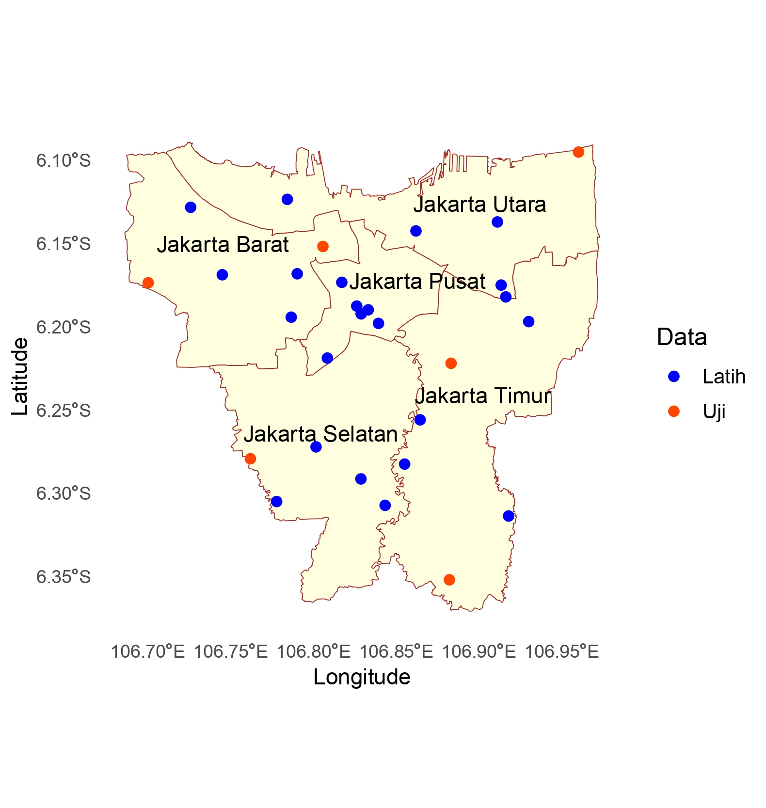
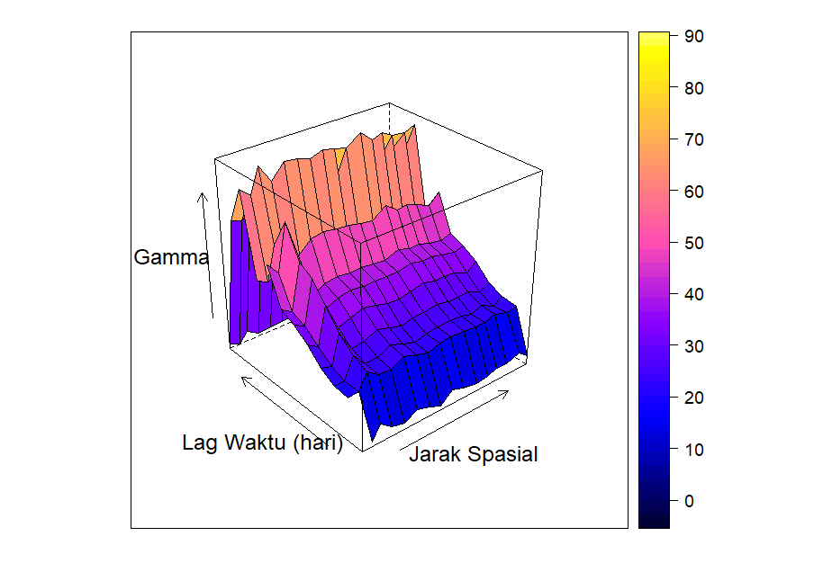
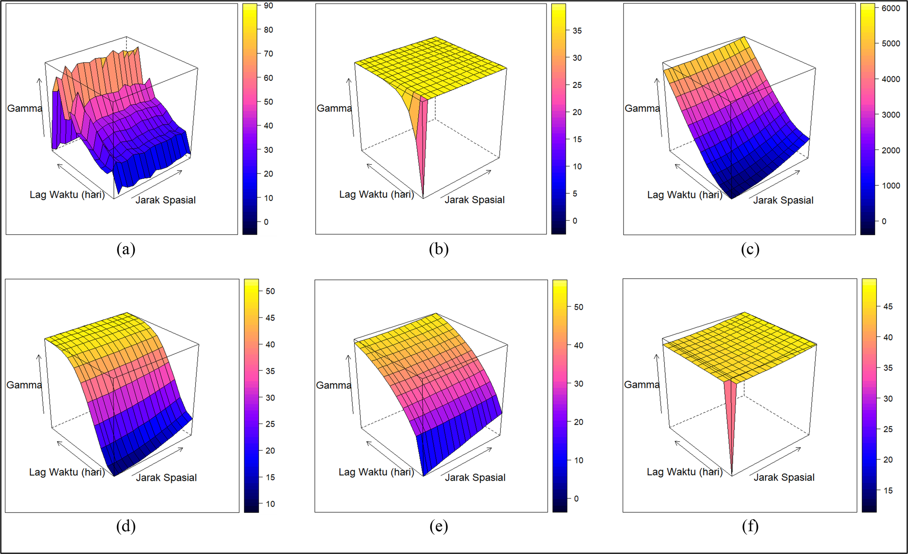
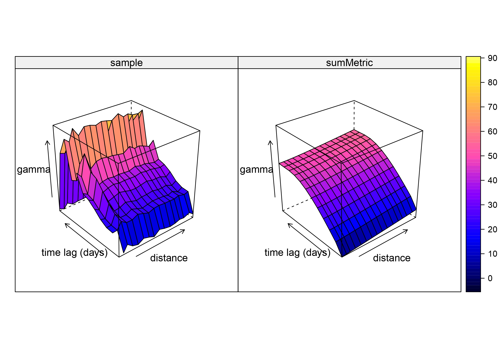
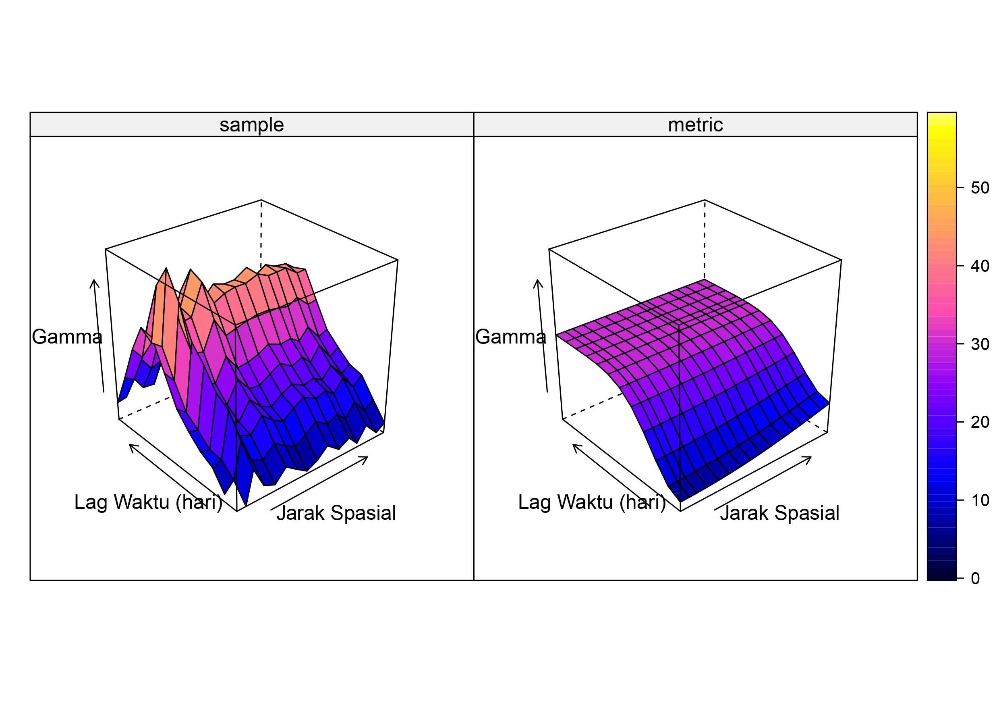
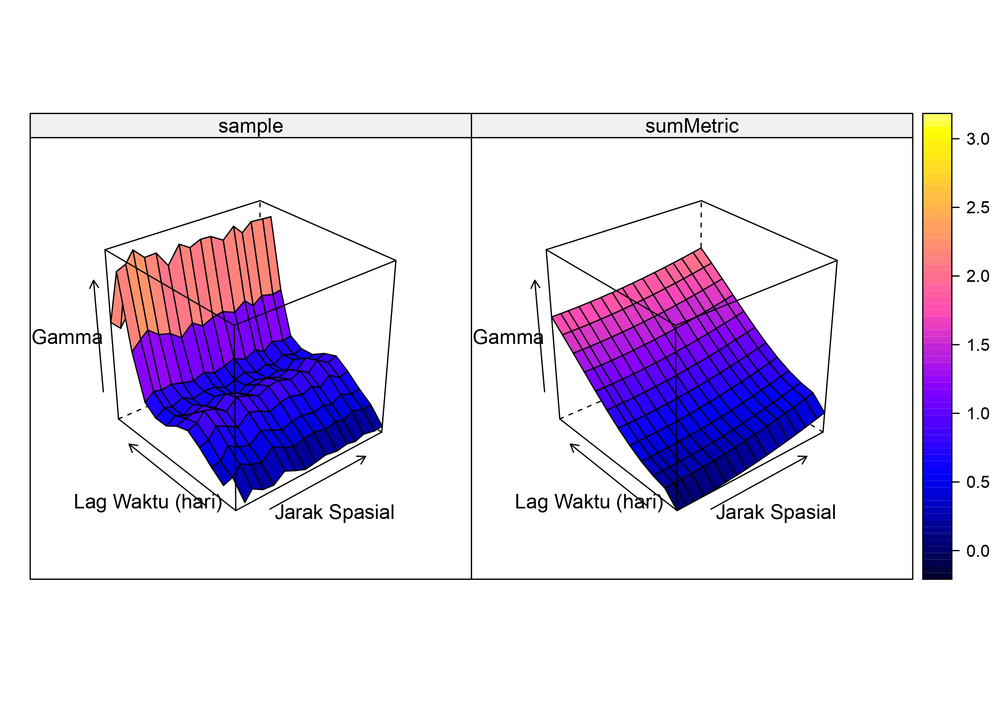
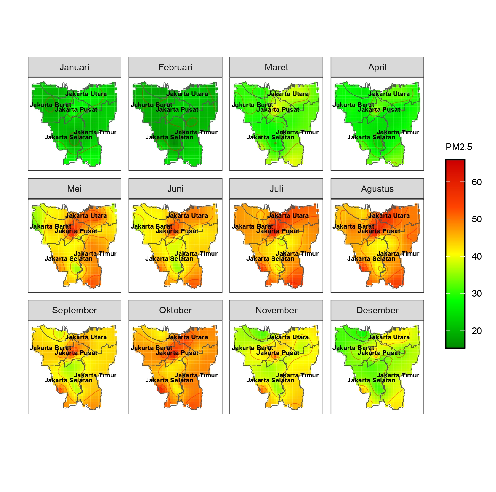

---
# Metode Spasiotemporal Cokriging untuk Penaksiran Konsentrasi $PM_{2.5}$ di Provinsi Daerah Khusus Ibukota Jakarta
Ditulis oleh: Fariza Alamanda Putri  
Program Studi Magister Statistika Terapan Universitas Padjadjaran

## Pendahuluan
<p style="text-indent: 30px;text-align: justify;">Polusi udara merupakan masalah lingkungan yang signifikan di kota-kota padat penduduk, terutama yang menjadi pusat kegiatan ekonomi dan industri, seperti Jakarta, ibu kota Indonesia. Polusi udara di Jakarta sebagian besar berasal dari konsumsi energi, penggunaan bahan bakar fosil, aktivitas rumah tangga, dan proses industri. Di antara polutan udara, partikel materi halus 2.5 ($PM_{2.5}$) menjadi ancaman serius bagi kesehatan manusia karena ukurannya yang kecil (≤ 2,5 mikrometer, disingkat µm), yang memungkinkan untuk masuk jauh ke dalam sistem pernapasan. Menyadari bahayanya, Pemerintah Indonesia telah menetapkan ambang batas sehat untuk $PM_{2.5}$ sebesar 50 µg/m³ (mikrogram per meter kubik). Informasi yang dapat diandalkan tentang konsentrasi $PM_{2.5}$ sangat penting bagi pembuat kebijakan untuk menyusun strategi mitigasi dan bagi masyarakat untuk melindungi diri dari paparan. </p>

<p style="text-indent: 30px;text-align: justify;">Meskipun penting, pemantauan konsentrasi $PM_{2.5}$ sering kali terbatas oleh ketersediaan peralatan pemantauan, yang mengakibatkan kekosongan data di berbagai wilayah. Untuk mengatasi hal ini, teknik interpolasi digunakan untuk memperkirakan konsentrasi polutan di lokasi yang tidak terpantau. Metode interpolasi yang umum digunakan meliputi Inverse Distance Weighting (IDW) dan kriging. </p>

<p style="text-indent: 30px;text-align: justify;">IDW memperkirakan nilai di titik yang tidak diketahui hanya berdasarkan jaraknya dari lokasi yang diketahui, dengan memberikan bobot lebih tinggi pada titik yang lebih dekat. Namun, IDW tidak memperhitungkan ketergantungan spasial atau pola variabilitas yang mendasarinya, dan tidak dapat memasukkan variabel prediktor tambahan, yang membatasi kemampuannya untuk memberikan estimasi akurat dalam sistem lingkungan yang kompleks. </p>

<p style="text-indent: 30px;text-align: justify;">Kriging meningkatkan IDW dengan memanfaatkan ketergantungan spasial melalui pemodelan semivariogram, yang menangkap hubungan antara variabilitas dan jarak di antara lokasi yang diamati. Hal ini menghasilkan prediksi yang lebih akurat dibandingkan IDW, terutama di wilayah dengan autokorelasi spasial yang signifikan. Namun, seperti IDW, kriging tidak memungkinkan dimasukkannya variabel prediktor dan tidak secara eksplisit mempertimbangkan ketergantungan temporal. </p>

<p style="text-indent: 30px;text-align: justify;">Namun, polusi udara dipengaruhi oleh kombinasi faktor spasial dan temporal, serta variabel sekunder seperti curah hujan, kelembapan, kecepatan angin, dan konsentrasi $NO_2$. Untuk mengatasi keterbatasan ini, cokriging spasiotemporal digunakan karena mengintegrasikan ketergantungan spasial dan temporal ke dalam model serta memungkinkan dimasukkannya variabel sekunder sebagai prediktor. Pendekatan ini memungkinkan analisis yang lebih komprehensif terhadap pola distribusi polutan dan meningkatkan akurasi prediksi dengan memasukkan pengaruh faktor lingkungan tambahan bersama konsentrasi $PM_{2.5}$. </p>

<p style="text-indent: 30px;text-align: justify;">Dalam konteks ini, mengintegrasikan ketergantungan spasial-temporal dan variabel lingkungan tambahan ke dalam model cokriging diharapkan dapat meningkatkan akurasi estimasi konsentrasi $PM_{2.5}$. Penelitian ini bertujuan untuk mengembangkan model cokriging spasiotemporal untuk memberikan prediksi yang lebih akurat tentang konsentrasi $PM_{2.5}$ di Jakarta. Dengan memasukkan curah hujan, kelembapan, kecepatan angin, dan konsentrasi $NO_2$ sebagai variabel sekunder, model yang diusulkan bertujuan untuk menangkap variasi spasial dan temporal secara lebih efektif, sehingga menghasilkan estimasi yang lebih akurat yang mencerminkan dinamika polusi. </p>


## Load package 
```{r, echo=T, collapse=F}
library(gstat); library(sf); library(spacetime); library(sp);library(ggplot2)
library(plotly); library(xts); library(RColorBrewer); library(openxlsx)
library(raster); library(geojson); library(patchwork); library(ggplotify)
library(moments); library(tidyr); library(dplyr); library(psych)
```

## Statistik Deskriptif  
Pertama, analisis statistik deskriptif dilakukan pada variabel-variabel penelitian.
```{r, echo=T, collapse=F}
# INPUT DATA
# PM2.5
pm25 = read.xlsx("D:/TESIS/DATA/Data Fix/DataRequest_UNPAD_FarizaAP_Jakarta2023.xlsx", 
                 sheet = "PM25")
pm25$time = ISOdate(pm25$Tahun, pm25$Bulan, 1, tz = "GMT")

stations = 3:31
pm25_mat = as.matrix(pm25[stations])
# Curah Hujan
presipitasi = read.xlsx("D:/TESIS/DATA/Data Fix/DataRequest_UNPAD_FarizaAP_Jakarta2023.xlsx", 
                        sheet = "Presipitasi")
presipitasi$time = ISOdate(presipitasi$Tahun, presipitasi$Bulan, 1, tz = "GMT")
stations = 3:31
presipitasi_mat = as.matrix(presipitasi[stations])
# Humidity
kelembaban = read.xlsx("D:/TESIS/DATA/Data Fix/DataRequest_UNPAD_FarizaAP_Jakarta2023.xlsx", 
                       sheet = "Kelembaban")  
kelembaban$time = ISOdate(kelembaban$Tahun, kelembaban$Bulan, 1, tz = "GMT")
stations = 3:31
kelembaban_mat = as.matrix(kelembaban[stations])
# Data Kecepatan Angin
angin = read.xlsx("D:/TESIS/DATA/Data Fix/DataRequest_UNPAD_FarizaAP_Jakarta2023.xlsx", 
                  sheet = "Kecepatan Angin")
angin$time = ISOdate(angin$Tahun, angin$Bulan, 1, tz = "GMT")
stations = 3:31
angin_mat = as.matrix(angin[stations])
# Data NO2
no2 = read.xlsx("D:/TESIS/DATA/Data Fix/DataRequest_UNPAD_FarizaAP_Jakarta2023.xlsx", 
                sheet = "NO2")
no2$time = ISOdate(no2$Tahun, no2$Bulan, 1, tz = "GMT")
stations = 3:31
no2_mat = as.matrix(no2[stations])

# MEMBUAT STFDF CLASS OBJECT
tesis.loc = read.xlsx("D:/TESIS/DATA/Data Fix/DataRequest_UNPAD_FarizaAP_Jakarta2023.xlsx",
                      sheet = "Koordinat")
coordinates(tesis.loc) = ~Longitude+Latitude
proj4string(tesis.loc) = "+proj=longlat +datum=WGS84"
pts = coordinates(tesis.loc)
rownames(pts) = tesis.loc$Sensor
pts = SpatialPoints(pts, CRS("+proj=longlat +datum=WGS84 +ellps=WGS84"))
utm48s = "+proj=utm +zone=48 +south +datum=WGS84 +units=m +no_defs"
pts.sfc = st_transform(st_as_sfc(pts), utm48s)
pts = as(pts.sfc, "Spatial")
# membuat spatial object dari data masing-masing variabel
pm25.data = stConstruct(pm25_mat, space = list(values = 1:ncol(pm25_mat)),
                        time = pm25$time, SpatialObj = pts, interval = TRUE)
presipitasi.data = stConstruct(presipitasi_mat, space = list(values = 1:ncol(presipitasi_mat)),
                               time = presipitasi$time, SpatialObj = pts, interval = TRUE)
kelembaban.data = stConstruct(kelembaban_mat, space = list(values = 1:ncol(kelembaban_mat)),
                              time = kelembaban$time, SpatialObj = pts, interval = TRUE)
angin.data = stConstruct(angin_mat, space = list(values = 1:ncol(angin_mat)),
                         time = angin$time, SpatialObj = pts, interval = TRUE)
no2.data = stConstruct(no2_mat, space = list(values = 1:ncol(no2_mat)),
                       time = no2$time, SpatialObj = pts, interval = TRUE)
# STFDF Object untuk gabungan
combined_data <- cbind(as.data.frame(pm25.data)[,-7],
                       PM25 = as.data.frame(pm25.data)[,7],
                       Presipitasi = as.data.frame(presipitasi.data)[,7],
                       Kelembaban = as.data.frame(kelembaban.data)[,7],
                       Angin = as.data.frame(angin.data)[,7],
                       NO2 = as.data.frame(no2.data)[,7])
```

```{r, echo=T}
descriptive_stats <- function(x) {
  c(
    Min = min(x, na.rm = TRUE),
    Max = max(x, na.rm = TRUE),
    Mean = mean(x, na.rm = TRUE),
    `Std Dev` = sd(x, na.rm = TRUE)
  )
}

# Menghitung statistik deskriptif dan membuat hasil dalam format panjang.
results_long <- combined_data[,6:11] %>%
  pivot_longer(cols = -timeIndex, names_to = "Variable", values_to = "Value") %>%
  group_by(Variable) %>%
  summarise(
    Minimum = min(Value, na.rm = TRUE),
    Maximum = max(Value, na.rm = TRUE),
    Mean = mean(Value, na.rm = TRUE),
    `Std Dev` = sd(Value, na.rm = TRUE),
    .groups = "drop"
  )

# Menampilkan hasil
print(results_long)
```
| **Variabel**   | **Minimum** | **Maksimum** | **Mean**     | **Std Dev**  |
|-----------------|-------------|-------------|--------------|--------------|
| Angin          | 2,14        | 6,22        | 3,794224     | 0,8696644    |
| Kelembaban     | 67,07       | 89,79       | 78,398784    | 4,8258985    |
| NO2            | 3,90        | 29,96774    | 19,367660    | 5,8341539    |
| PM25           | 14,56       | 68,83       | 39,574875    | 11,6912578   |
| Presipitasi    | 0,00        | 558,83      | 139,817902   | 137,7821747  |

<p style="text-indent: 30px;text-align: justify;">Konsentrasi $PM_{2.5}$ menunjukkan variasi sepanjang tahun, yang ditunjukkan oleh standar deviasi sebesar 11,69 µg/m³. Nilai ini menunjukkan bahwa konsentrasi $PM_{2.5}$ menyimpang sebesar 11,69 µg/m³ dari rata-rata. Konsentrasi $PM_{2.5}$ terendah terjadi pada bulan Februari, dengan nilai 14,56 µg/m³, sedangkan konsentrasi maksimum tercatat pada bulan Agustus, mencapai 68,83 µg/m³. Konsentrasi $NO_{2}$ terendah adalah 3,9 µg/m³, yang terjadi pada bulan Desember, sedangkan konsentrasi tertinggi, juga tercatat pada bulan Desember tetapi di lokasi yang berbeda, adalah 29,97 µg/m³. Curah hujan menunjukkan variabilitas yang lebih tinggi dibandingkan dengan variabel lainnya, sebagaimana tercermin dalam standar deviasi sebesar 137,78 mm. Curah hujan minimum di Jakarta selama periode 2023 adalah 0 mm, yang menunjukkan tidak ada hujan sama sekali dalam satu bulan penuh, sedangkan curah hujan maksimum mencapai 558,83 mm. Variabel kelembapan udara dan kecepatan angin menunjukkan nilai yang relatif homogen di seluruh lokasi dan periode waktu, dengan standar deviasi masing-masing sebesar 4,82% dan 0,87 m/s. </p>

## Analisis Korelasi  
<p style="text-indent: 30px;text-align: justify;">Terdapat korelasi negatif antara curah hujan, kelembapan udara, dan kecepatan angin terhadap konsentrasi $PM_{2.5}$. Ketika kelembapan udara, kecepatan angin, dan curah hujan meningkat, konsentrasi $PM_{2.5}$ cenderung menurun. Sebaliknya, $NO_{2}$ memiliki korelasi positif dengan $PM_{2.5}$. Ini berarti bahwa konsentrasi $PM_{2.5}$ juga akan meningkat seiring dengan meningkatnya $NO_{2}$. </p>

```{r, echo=T}
corr.test(combined_data[,c(7,11,8:10)], method = 'pearson', adjust = 'none')
```
|                | **PM25** | **NO2** | **Presipitasi** | **Kelembaban** | **Angin** |
|----------------|----------|---------|-----------------|----------------|-----------|
| **PM25**       | 1,00     | 0,31    | -0,58           | -0,13          | -0,75     |
| **NO2**        | 0,31     | 1,00    | -0,34           | -0,43          | -0,19     |
| **Presipitasi**| -0,58    | -0,34   | 1,00            | 0,73           | 0,54      |
| **Kelembaban** | -0,13    | -0,43   | 0,73            | 1,00           | 0,04      |
| **Angin**      | -0,75    | -0,19   | 0,54            | 0,04           | 1,00      |

## Data Splitting
Dari total sampel sebanyak 29 titik, data akan dibagi menjadi 80% data pelatihan (23 titik) dan 20% data pengujian (6 titik).
```{r}
# Baca data lokasi stasiun dari file Excel
sensor_loc <- read.xlsx("D:/TESIS/DATA/Data Fix/DataRequest_UNPAD_FarizaAP_Jakarta2023.xlsx", 
                        sheet = 'Koordinat')
# RANDOM SAMPLE
sample_index = unique(combined_data$sp.ID)
#set.seed(123) # untuk konsistensi
#test_indices <- sample(sample_index, size = round(0.2 * length(sample_index),0))
#saveRDS(test_indices, 
#        "D:/TESIS/DATA/Data Fix/indeks wilayah test.RDS")
test_samples = readRDS("D:/TESIS/DATA/Data Fix/indeks wilayah test.RDS")
train_samples = as.numeric(setdiff(sample_index, test_samples))

# Convert the data frame to a spatial points data frame
stasiun_test = st_as_sf(sensor_loc[sensor_loc$Sensor %in% c("Cibubur", "Cipinang Besar",
                                                      "Duri Utara", "Marunda",
                                                      "Rempoa Permai", "Semanan"),], 
                         coords = c("Longitude", "Latitude"), crs = 4326)
stasiun_train = st_as_sf(sensor_loc[!(sensor_loc$Sensor %in% c("Cibubur", "Cipinang Besar",
                                                            "Duri Utara", "Marunda",
                                                            "Rempoa Permai", "Semanan")),],
                        coords = c("Longitude", "Latitude"), crs = 4326)

# Load the Jakarta boundary shapefile (adjust the path to your shapefile)
province_boundary = st_read("D:/TESIS/DATA/SHP/gadm41_IDN_2.shp")

# Inspect the structure of the province_boundary
str(province_boundary)

jkt_boundary <- province_boundary %>% 
  filter(NAME_1 == "Jakarta Raya")
#jkt_boundary[-6,"NAME_EN"] = c('West Jakarta', 'Central Jakarta', 'South Jakarta',
#                               'East Jakarta', 'North Jakarta')
jkt_boundary[-6,"NAME_EN"] = c('Jakarta Barat', 'Jakarta Pusat', 'Jakarta Selatan',
                               'Jakarta Timur', 'Jakarta Utara')
# Extract the boundary lines for visualization
boundary_lines <- st_cast(jkt_boundary, "MULTILINESTRING")

# Plot the points and the filtered Jakarta boundary with legend title as "SPKU"
ggplot() +
  geom_sf(data = jkt_boundary[-6,], fill = "lightyellow", color = "brown") +
  geom_sf_text(data = jkt_boundary[-6,], aes(label = NAME_EN), size = 4, 
               nudge_y = c(0.01, 0.01, 0.02, 0.02, 0.01), 
               nudge_x = c(0, 0.02, 0, 0.02, 0), color = "black") +  
  geom_sf(data = stasiun_train, aes(color = "Latih"), size = 2) +  # Tambahkan label legenda
  geom_sf(data = stasiun_test, aes(color = "Uji"), size = 2) +     # Tambahkan label legenda
  scale_color_manual(name = "Data", values = c("Latih" = "blue", "Uji" = "orangered")) + # Skala warna
  theme_minimal() +
  labs(x = "Longitude",
       y = "Latitude") +
  theme(panel.grid.major = element_blank(), # hapus grid
        panel.grid.minor = element_blank(), # hapus grid
        legend.title = element_text(size = 12),  # Ukuran judul legenda
        legend.text = element_text(size = 10))   # Ukuran teks legenda
```



<p style="text-indent: 30px;text-align: justify;">Gambar tersebut menunjukkan pembagian data yang digunakan sebagai data latih dan data uji. Observasi yang ditunjukkan oleh titik berwarna biru menunjukkan data latih, sedangkan titik berwarna merah menunjukkan data uji. Berikut ini adalah proses membagi data dan mengubah data ke dalam format STFDF </p>

```{r}
# Konversi kolom waktu ke format POSIXct
Sys.setenv(TZ = "GMT")
time = as.POSIXct(unique(combined_data$time), tz = "GMT")

# RANDOM SAMPLE
sample_index = unique(combined_data$sp.ID)
#set.seed(123) # untuk konsistensi
#test_indices <- sample(sample_index, size = round(0.2 * length(sample_index),0))
#saveRDS(test_indices, 
#        "D:/TESIS/DATA/Data Fix/indeks wilayah test.RDS")
test_samples = readRDS("D:/TESIS/DATA/Data Fix/indeks wilayah test.RDS")

# Membuat objek STFDF DATA TRAIN
train_samples = as.numeric(setdiff(sample_index, test_samples))
train_data = combined_data[combined_data$sp.ID %in% train_samples, ]
coords_train = unique(train_data[, c("coords.x1","coords.x2")])
pts_train = coordinates(coords_train)
pts_train = SpatialPoints(pts_train,
                          CRS("+proj=utm +zone=48 +south +datum=WGS84 +units=m +no_defs"))
utm48s = "+proj=utm +zone=48 +south +datum=WGS84 +units=m +no_defs"
pts_train.sfc = st_transform(st_as_sfc(pts_train), utm48s)
pts_train = as(pts_train.sfc, "Spatial")
stfdf.train = STFDF(sp = pts_train, time = time, data = train_data[,7:11])
stfdf.train

# STFDF DATA TEST
test_data = combined_data[combined_data$sp.ID %in% test_samples, ]
coords_test = unique(test_data[, c("coords.x1","coords.x2")])
pts_test = coordinates(coords_test)
pts_test = SpatialPoints(pts_test,
                         CRS("+proj=utm +zone=48 +south +datum=WGS84 +units=m +no_defs"))
utm48s = "+proj=utm +zone=48 +south +datum=WGS84 +units=m +no_defs"
pts_test.sfc = st_transform(st_as_sfc(pts_test), utm48s)
pts_test = as(pts_test.sfc, "Spatial")
stfdf.test = STFDF(sp = pts_test, time = time, data = test_data[,7:11])
stfdf.test
```

## Empirical Semivariogram

```{r}
# membuat object gstat untuk variogram
g <- gstat(NULL, "PM25", PM25 ~ 1, data = stfdf.train, fill.cross = TRUE) %>%
  gstat("Presipitasi", Presipitasi ~ 1, data = stfdf.train, fill.cross = TRUE) %>%
  gstat("Kelembaban", Kelembaban ~ 1, data = stfdf.train, fill.cross = TRUE) %>%
  gstat("Angin", Angin ~ 1, data = stfdf.train, fill.cross = TRUE) %>%
  gstat("NO2", NO2 ~ 1, data = stfdf.train, fill.cross = TRUE)

# =========================================Menghitung cross-variogram empiris
var <- variogramST(g, data = stfdf.train, 
                   assumeRegular = TRUE, pseudo = 1)
plot(var)
#write.xlsx(var, "D:/TESIS/Hasil/excels/Semivariogram empiris.xlsx")
```



<p style="text-indent: 30px;text-align: justify;">Semivariogram empiris dihasilkan menggunakan data pelatihan yang terdiri dari 23 titik lokasi selama periode 12 bulan. Komponen spasial dari semivariogram empiris menunjukkan variasi minimal dalam nilai gamma seiring dengan bertambahnya jarak spasial, yang mengindikasikan variabilitas spasial yang terbatas dalam rentang pengamatan. Sebaliknya, nilai gamma menunjukkan peningkatan yang jelas seiring dengan bertambahnya lag waktu, mencerminkan variabilitas yang lebih besar seiring waktu. Menariknya, penurunan nilai gamma diamati pada lag waktu terbesar, yang mungkin menunjukkan efek smoothing atau korelasi temporal yang berkurang pada interval yang lebih panjang. </p>

<p style="text-indent: 30px;text-align: justify;">Semivariogram empiris kemudian dimodelkan menggunakan berbagai semivariogram teoretis. Dengan menggabungkan tiga model semivariogram marginal (spherical, exponential, dan Gaussian) untuk komponen spasial, temporal, dan gabungan (spasial), total 9 model separable, 9 model product-sum, 3 model metric, 27 model sum-metric, dan 27 model simple sum-metric dievaluasi. Gambar menggambarkan bentuk semivariogram spasiotemporal yang dihasilkan dari kombinasi terbaik di setiap kategori model teoretis. Proses pemodelan ini bertujuan untuk menentukan semivariogram teoretis mana yang paling akurat menangkap pola variabilitas spasiotemporal yang diamati dalam semivariogram empiris. </p>

```{r}
print(var)
```
| **np** | **dist**   | **gamma**  | **id**   | **timelag** | **spacelag** | **avgDist** |
|--------|------------|------------|----------|-------------|--------------|-------------|
| 0      | NA         | NA         | lag0     | 0 days      | 0,000        | 0,0000      |
| 24     | 721,5611   | 2,119802   | lag0     | 0 days      | 449,318      | 721,5611    |
| 12     | 1319,6596  | 8,503237   | lag0     | 0 days      | 1347,954     | 1319,6596   |
| 60     | 2161,6545  | 4,327761   | lag0     | 0 days      | 2246,590     | 2161,6545   |
| 72     | 3074,1309  | 2,719611   | lag0     | 0 days      | 3145,226     | 3074,1309   |
| 96     | 3980,1009  | 6,023574   | lag0     | 0 days      | 4043,862     | 3980,1009   |
| ...    | ...        | ...        | ...      | ...         | ...          | ...         |
| 187    | 8604,812   | 2,860425   | lag11    | 341 days    | 8537,042     | 8604,812    |
| 188    | 9515,440   | 3,537421   | lag11    | 341 days    | 9435,678     | 9515,440    |
| 189    | 10284,410  | 17,669637  | lag11    | 341 days    | 10334,314    | 10284,410   |
| 190    | 11077,128  | 2,925169   | lag11    | 341 days    | 11232,950    | 11077,128   |
| 191    | 12132,165  | 30,303786  | lag11    | 341 days    | 12131,586    | 12132,165   |
| 192    | 12892,806  | 2,563838   | lag11    | 341 days    | 13030,222    | 12892,806   |

Jika ingin membuat plot 3D interaktif dapat menggunakan code dibawah ini
```{r}
# Ekstrak informasi dari variogramST object
gamma_values <- var$gamma  # Nilai variogram (semivariance)
distances <- var$spacelag  # Jarak (spatial lag)
time_lags <- var$timelag   # Time lag (temporal)

# Membuat plot interaktif 3D
plot_ly(x = ~distances, y = ~time_lags, z = ~gamma_values, 
        intensity = ~gamma_values, type = 'mesh3d', 
        colors = colorRamp(c("darkblue", "blue", "red", "orange", "yellow"))) %>%
  layout(scene = list(
    xaxis = list(title = "Jarak spasial"),
    yaxis = list(title = "Lag Waktu (hari)"),
    zaxis = list(title = "Gamma")
  )) %>%
  colorbar(title = "Gamma")
```
## Semivariogram Fitting
```{r}
# setting lower and upper bounds
pars.l <- c(sill.s = 13.75739, range.s = 0.1*30762.69, nugget.s = 0, 
            sill.t = 43.72425, range.t = 31, nugget.t = 0, 
            sill.st = 0.1*136.6855, range.st = sqrt((0.1*30762.69^2) + (31*0)^2), nugget.st = 0, 
            anis = 0)
pars.u <- c(sill.s = 70.55745, range.s = 30762.69, nugget.s = 0.5*70.55745, 
            sill.t = 214.7959, range.t = 341, nugget.t = 0.5*214.7959, 
            sill.st = 136.6855, range.st = sqrt((30762.69^2) + (341*928)^2), nugget.st = 0.5*136.6855, 
            anis = 928) 

# separable
# daftar_model = c("Gau", "Sph", "Exp")
# model_space = c()
# model_temporal = c()
# model_joint = c()
# MSE = c()
# for(sm in daftar_model){
#   for(tm in daftar_model){
#     model_space = c(model_space, sm)
#     model_temporal = c(model_temporal, tm)
#     separable <- vgmST("separable", space = vgm(psill = 13.75739, model = sm, range = 0.1*30762.69, nugget = 0),
#                        time = vgm(psill = 109.7589, model = tm, range = 217, nugget = 0), sill = 43.72425)
#     separable_Vgm <- fit.StVariogram(var, separable, fit.method = 6, method="L-BFGS-B", upper = pars.u)
#     MSE = c(MSE, attr(separable_Vgm, "MSE"))
#   }
# }
# separable = data.frame(Spatial = model_space, 
#                        Temporal = model_temporal,
#                        MSE = as.numeric(MSE))
# separable[separable$MSE==min(separable$MSE),]
# write.xlsx(separable, "D:/TESIS/Hasil/excels/MSE Separable.xlsx")

# product-sum
# daftar_model = c("Gau", "Sph", "Exp")
# model_space = c()
# model_temporal = c()
# MSE = c()
# for(sm in daftar_model){
#   for(tm in daftar_model){
#     model_space = c(model_space, sm)
#     model_temporal = c(model_temporal, tm)
#     prodSumModel <- vgmST("productSum", space = vgm(psill = 13.75739, model = sm, range = 0.5*30762.69, nugget = 0),
#                           time = vgm(psill = 109.7589, model = tm, range = 217, nugget = 0), k = 0.5) 
#     # Menggunakan tryCatch untuk menangani error
#     fit_result <- tryCatch({
#       fit.StVariogram(var, prodSumModel, fit.method = 6, method = "L-BFGS-B", lower = pars.l, upper = pars.u)
#     }, error = function(e) {
#       return(NULL)  # Jika ada error, kembalikan NULL
#     })

#     # Jika hasil fitting ada error, tambahkan NA ke MSE, jika tidak, tambahkan MSE dari model
#     if (is.null(fit_result)) {
#       MSE = c(MSE, 0)
#     } else {
#       MSE = c(MSE, attr(fit_result, "MSE"))
#     }
#   }
# }
# prodsum = data.frame(Spatial = model_space, 
#                      Temporal = model_temporal,
#                      MSE = as.numeric(MSE))
# prodsum[prodsum$MSE==min(prodsum$MSE),]
# write.xlsx(prodsum, "D:/TESIS/Hasil/excels/MSE Product-Sum.xlsx")

# Metric
# daftar_model = c("Gau", "Sph", "Exp")
# model_joint = c()
# MSE = c()
# for(j in daftar_model){
#     model_joint = c(model_joint, j)
#     metric <- vgmST("metric", joint = vgm(psill = 136.6855, model = j, range = 0.5*30762.69, nugget = 0), stAni=1) 
#     metric_Vgm <- fit.StVariogram(var, metric, method="L-BFGS-B", lower = pars.l, upper = pars.u)
#     MSE = c(MSE, attr(metric_Vgm, "MSE"))
# }
# metric = data.frame(Joint = model_joint,
#                     MSE = as.numeric(MSE))
# metric[metric$MSE==min(metric$MSE),]
# write.xlsx(metric, "D:/TESIS/Hasil/excels/MSE Metric.xlsx")

# Sum-Metric
# daftar_model = c("Gau", "Sph", "Exp")
# model_space = c()
# model_temporal = c()
# model_joint = c()
# MSE = c()
# for(sm in daftar_model){
#   for(tm in daftar_model){
#     for(j in daftar_model){
#       model_space = c(model_space, sm)
#       model_temporal = c(model_temporal, tm)
#       model_joint = c(model_joint, j)
#       sumMetric <- vgmST("sumMetric", space = vgm(psill = 13.75739, model = sm, range = 0.5*30762.69, nugget = 0),
#                          time = vgm(psill = 109.7589, model = tm, range = 217, nugget = 0), 
#                          joint = vgm(psill = 136.6855, model = j, range = 0.5*sqrt((30762.69^2) + (341*1.5)^2), nugget = 0), stAni=500)
#       # Menggunakan tryCatch untuk menangani error
#       fit_result <- tryCatch({
#         fit.StVariogram(var, sumMetric, fit.method = 6, method = "L-BFGS-B", lower = pars.l, upper = pars.u)
#       }, error = function(e) {
#         return(NULL)  # Jika ada error, kembalikan NULL
#       })

#       # Jika hasil fitting ada error, tambahkan NA ke MSE, jika tidak, tambahkan MSE dari model
#       if (is.null(fit_result)) {
#         MSE = c(MSE, 0)
#       } else {
#         MSE = c(MSE, attr(fit_result, "MSE"))
#       }
#     }
#   }
# }
# summetric = data.frame(Spatial = model_space, 
#                        Temporal = model_temporal,
#                        Joint = model_joint,
#                        MSE = as.numeric(MSE))
# summetric
# write.xlsx(summetric, "D:/TESIS/Hasil/excels/MSE Sum Metric.xlsx")

# Simple Sum-Metric
# daftar_model = c("Gau", "Sph", "Exp")
# model_space = c()
# model_temporal = c()
# model_joint = c()
# MSE = c()
# for(sm in daftar_model){
#   for(tm in daftar_model){
#     for(j in daftar_model){
#       model_space = c(model_space, sm)
#       model_temporal = c(model_temporal, tm)
#       model_joint = c(model_joint, j)
#       SimplesumMetric <- vgmST("simpleSumMetric", space = vgm(psill = 13.75739, model = sm, range = 0.5*30762.69, nugget = 0),
#                                time = vgm(psill = 109.7589, model = tm, range = 217, nugget = 0), 
#                                joint = vgm(psill = 136.6855, model = j, range = sqrt((30762.69^2) + (341*1.5)^2), nugget = 0), nugget = 0, stAni=500, k = 0.5)
#       # Menggunakan tryCatch untuk menangani error
#       fit_result <- tryCatch({
#         fit.StVariogram(var, SimplesumMetric, fit.method = 6, method = "L-BFGS-B", lower = pars.l, upper = pars.u)
#       }, error = function(e) {
#         return(NULL)  # Jika ada error, kembalikan NULL
#       })

#       # Jika hasil fitting ada error, tambahkan NA ke MSE, jika tidak, tambahkan MSE dari model
#       if (is.null(fit_result)) {
#         MSE = c(MSE, 0)
#       } else {
#         MSE = c(MSE, attr(fit_result, "MSE"))
#       }
#     }
#   }
# }
# ssmetric = data.frame(Spatial = model_space,
#                       Temporal = model_temporal,
#                       Joint = model_joint,
#                       MSE = as.numeric(MSE))
# ssmetric
# write.xlsx(ssmetric, "D:/TESIS/Hasil/excels/MSE Simple-Sum Metric.xlsx")

# separable = read.xlsx("D:/TESIS/Hasil/excels/MSE Separable.xlsx")
# prodsum = read.xlsx("D:/TESIS/Hasil/excels/MSE Product-Sum.xlsx")
# metric = read.xlsx("D:/TESIS/Hasil/excels/MSE Metric.xlsx")
# summetric = read.xlsx("D:/TESIS/Hasil/excels/MSE Sum Metric.xlsx")
# ssmetric = read.xlsx("D:/TESIS/Hasil/excels/MSE Simple-Sum Metric.xlsx")

# separable[separable$MSE==min(separable$MSE),]
# prodsum=prodsum[prodsum$MSE>0,]
# prodsum[prodsum$MSE==min(prodsum$MSE, na.rm = T),]
# metric[metric$MSE==min(metric$MSE, na.rm = T),]
# summetric=summetric[summetric$MSE>0,]
# summetric[summetric$MSE==min(summetric$MSE, na.rm = T),]
# ssmetric=ssmetric[ssmetric$MSE>0,]
# ssmetric[ssmetric$MSE==min(ssmetric$MSE, na.rm = T),]

# ==============================================================MODEL TERBAIK
# separable
separable <- vgmST("separable", space = vgm(psill = 13.75739, model = 'Exp', range = 0.5*30762.69, nugget = 0),
                   time = vgm(psill = 109.7589, model = 'Exp', range = 217, nugget = 0), sill = 43.72425)
separable_Vgm <- fit.StVariogram(var, separable, fit.method = 6, method="L-BFGS-B", upper = pars.u)
param_sep = extractPar(separable_Vgm)

# product-sum
prodSumModel <- vgmST("productSum", space = vgm(psill = 13.75739, model = 'Gau', range = 0.5*30762.69, nugget = 0),
                      time = vgm(psill = 109.7589, model = 'Gau', range = 217, nugget = 0), k = 10) 
prodSumModel_Vgm <- fit.StVariogram(var, prodSumModel, method = "L-BFGS-B", fit.method = 6, lower = pars.l, upper = pars.u)
param_prodsum = extractPar(prodSumModel_Vgm)

# Metric
metric <- vgmST("metric", joint = vgm(psill = 136.6855, model = 'Gau', range = 0.5*30762.69, nugget = 0), stAni=1.5) 
metric_Vgm <- fit.StVariogram(var, metric, method="L-BFGS-B", fit.method = 6, lower = pars.l, upper = pars.u)
param_metric = extractPar(metric_Vgm)

# Sum-Metric
sumMetric <- vgmST("sumMetric", space = vgm(psill = 13.75739, model = 'Gau', range = 0.5*30762.69, nugget = 0),
                   time = vgm(psill = 109.7589, model = 'Exp', range = 217, nugget = 0), 
                   joint = vgm(psill = 136.6855, model = 'Sph', range = 0.5*sqrt((30762.69^2) + (341*1.5)^2), nugget = 0), stAni=500)
sumMetric_Vgm <- fit.StVariogram(var, sumMetric, method="L-BFGS-B", tunit="days", fit.method = 6, lower = pars.l, upper = pars.u)
param_summetric = extractPar(sumMetric_Vgm)

# Simple Sum-Metric
SimplesumMetric <- vgmST("simpleSumMetric", space = vgm(psill = 13.75739, model = 'Gau', range = 0.5*30762.69, nugget = 0),
                         time = vgm(psill = 109.7589, model = 'Gau', range = 217, nugget = 0), 
                         joint = vgm(psill = 136.6855, model = 'Exp', range = sqrt((31000^2) + (341*1.5)^2), nugget = 0), nugget = 0, stAni=0.5) 
SimplesumMetric_Vgm <- fit.StVariogram(var, SimplesumMetric, method = "L-BFGS-B", fit.method = 6, lower = pars.l, upper = pars.u)
param_ssmetric = extractPar(SimplesumMetric_Vgm)

# =========================================================PLOT SEMIVARIOGRAM
sampel_plot = plot(var, wireframe=T, xlab = NULL, ylab = NULL, zlab = NULL)
sep_plot = plot(var,separable_Vgm, wireframe=T, xlab = NULL, ylab = NULL, zlab = NULL)
ps_plot = plot(var,prodSumModel_Vgm,wireframe=T, xlab = NULL, ylab = NULL, zlab = NULL)
metric_plot = plot(var, metric_Vgm, wireframe=T, xlab = NULL, ylab = NULL, zlab = NULL)
summet_plot = plot(var,sumMetric_Vgm,wireframe=T, xlab = NULL, ylab = NULL, zlab = NULL)
ssmet_plot = plot(var,SimplesumMetric_Vgm,wireframe=T, xlab = NULL, ylab = NULL, zlab = NULL)

sampel_plot = as.ggplot(sampel_plot)
sep_plot <- as.ggplot(sep_plot)
ps_plot <- as.ggplot(ps_plot)
metric_plot <- as.ggplot(metric_plot)
summet_plot <- as.ggplot(summet_plot)
ssmet_plot <- as.ggplot(ssmet_plot)

# Combine the plots using wrap_plots
semivar_plot <- wrap_plots(
  list(sampel_plot, sep_plot, ps_plot, metric_plot, summet_plot, ssmet_plot), 
  ncol = 3) +
  plot_layout(guides = "auto") +
  plot_annotation(title = "Perbandingan Semivariogram Empiris dengan Semivariogram Teoretis")

# Print the combined plot
print(semivar_plot)
```


<p style="text-indent: 30px;text-align: justify;">Semivariogram teoretis dengan MSE terendah menunjukkan kemampuannya untuk menjelaskan pola variabilitas yang diamati dalam semivariogram empiris. Oleh karena itu, semivariogram teoretis dengan MSE terendah akan digunakan untuk menghasilkan matriks gamma dalam persamaan prediksi cokriging. Model teoretis dengan MSE terendah adalah model sum-metric dengan nilai MSE sebesar 292,152. Selain itu, juga terlihat bahwa semivariogram sum-metric menunjukkan pola yang paling mirip dengan semivariogram empiris. Dengan demikian, model sum-metric akan digunakan untuk menghasilkan matriks gamma $\Gamma_{11}$ untuk perhitungan bobot cokriging selanjutnya.</p>

## Cross-Variogram Fitting
<p style="text-indent: 30px;text-align: justify;">Proses fitting juga dilakukan terhadap cross-variogram antara variabel $PM_{2.5}$ dengan variabel prediktor menggunakan langkah yang sama seperti pada fitting semivariogram. Fitting dilakukan menggunakan model teoretis product, product-sum, metric, sum-metric, dan simple sum-metric. Proses ini dilakukan untuk mendapatkan estimasi nilai parameter cross-variogram dengan meminimalkan selisih antara nilai empiris dengan teoretis menggunakan metode OLS. Proses ini akan menghasilkan fungsi kontinu yang akan digunakan dalam pembangkitan nilai cross-variogram.</p>    

### Cross-Variogram antara $PM_{2.5}$ and $NO_{2}$
```{r}
# =========================================PM25~NO2
g_2 <- gstat(NULL, "PM25", PM25 ~ 1, data = stfdf.train, fill.cross = TRUE) %>%
  gstat("NO2", NO2 ~ 1, data = stfdf.train, fill.cross = TRUE)

# Menghitung cross-variogram empiris
cross_var_2 <- variogramST(g_2, data = stfdf.train, 
                           assumeRegular = TRUE, pseudo = 1)

pars.l <- c(sill.s = 13.75739, range.s = 0.1*30762.69, nugget.s = 0, 
            sill.t = 43.72425, range.t = 31, nugget.t = 0, 
            sill.st = 0.1*136.6855, range.st = sqrt((0.1*30762.69^2) + (31*0)^2), nugget.st = 0, 
            anis = 10)
pars.u <- c(sill.s = 70.55745, range.s = 30762.69, nugget.s = 0.5*70.55745, 
            sill.t = 214.7959, range.t = 341, nugget.t = 0.5*214.7959, 
            sill.st = 136.6855, range.st = sqrt((30762.69^2) + (341*928)^2), nugget.st = 0.5*136.6855, 
            anis = 928)
# # separable
# daftar_model = c("Gau", "Sph", "Exp")
# model_space = c()
# model_temporal = c()
# model_joint = c()
# MSE = c()
# for(sm in daftar_model){
#   for(tm in daftar_model){
#     model_space = c(model_space, sm)
#     model_temporal = c(model_temporal, tm)
#     separable <- vgmST("separable", space = vgm(psill = 13.75739, model = sm, range = 0.1*30762.69, nugget = 0),
#                        time = vgm(psill = 109.7589, model = tm, range = 217, nugget = 0), sill = 43.72425)
#     separable_Vgm <- fit.StVariogram(cross_var_2, separable, fit.method = 6, method="L-BFGS-B", upper = pars.u)
#     MSE = c(MSE, attr(separable_Vgm, "MSE"))
#   }
# }
# separable = data.frame(Spatial = model_space, 
#                        Temporal = model_temporal,
#                        MSE = as.numeric(MSE))
# separable[separable$MSE==min(separable$MSE),]

# # product-sum
# daftar_model = c("Gau", "Sph", "Exp")
# model_space = c()
# model_temporal = c()
# MSE = c()
# for(sm in daftar_model){
#   for(tm in daftar_model){
#     model_space = c(model_space, sm)
#     model_temporal = c(model_temporal, tm)
#     prodSumModel <- vgmST("productSum", space = vgm(psill = 13.75739, model = sm, range = 0.5*30762.69, nugget = 0),
#                           time = vgm(psill = 109.7589, model = tm, range = 217, nugget = 0), k = 0.5) 
#     # Menggunakan tryCatch untuk menangani error
#     fit_result <- tryCatch({
#       fit.StVariogram(cross_var_2, prodSumModel, fit.method = 6, method = "L-BFGS-B", lower = pars.l, upper = pars.u)
#     }, error = function(e) {
#       return(NULL)  # Jika ada error, kembalikan NULL
#     })
#     
#     # Jika hasil fitting ada error, tambahkan NA ke MSE, jika tidak, tambahkan MSE dari model
#     if (is.null(fit_result)) {
#       MSE = c(MSE, 0)
#     } else {
#       MSE = c(MSE, attr(fit_result, "MSE"))
#     }
#   }
# }
# prodsum = data.frame(Spatial = model_space, 
#                      Temporal = model_temporal,
#                      MSE = as.numeric(MSE))
# prodsum[prodsum$MSE==min(prodsum$MSE),]

# # Metric
# daftar_model = c("Gau", "Sph", "Exp")
# model_joint = c()
# MSE = c()
# for(j in daftar_model){
#   model_joint = c(model_joint, j)
#   metric <- vgmST("metric", joint = vgm(psill = 136.6855, model = j, range = 0.5*30762.69, nugget = 0), stAni=1) 
#   metric_Vgm <- fit.StVariogram(cross_var_2, metric, method="L-BFGS-B", lower = pars.l, upper = pars.u)
#   MSE = c(MSE, attr(metric_Vgm, "MSE"))
# }
# metric = data.frame(Joint = model_joint,
#                     MSE = as.numeric(MSE))
# metric[metric$MSE==min(metric$MSE),]

# # Sum-Metric
# daftar_model = c("Gau", "Sph", "Exp")
# model_space = c()
# model_temporal = c()
# model_joint = c()
# MSE = c()
# for(sm in daftar_model){
#   for(tm in daftar_model){
#     for(j in daftar_model){
#       model_space = c(model_space, sm)
#       model_temporal = c(model_temporal, tm)
#       model_joint = c(model_joint, j)
#       sumMetric <- vgmST("sumMetric", space = vgm(psill = 13.75739, model = sm, range = 0.5*30762.69, nugget = 0),
#                          time = vgm(psill = 109.7589, model = tm, range = 217, nugget = 0), 
#                          joint = vgm(psill = 136.6855, model = j, range = 0.5*sqrt((30762.69^2) + (341*1.5)^2), nugget = 0), stAni=500)
#       # Menggunakan tryCatch untuk menangani error
#       fit_result <- tryCatch({
#         fit.StVariogram(cross_var_2, sumMetric, fit.method = 6, method = "L-BFGS-B", lower = pars.l, upper = pars.u)
#       }, error = function(e) {
#         return(NULL)  # Jika ada error, kembalikan NULL
#       })
#       
#       # Jika hasil fitting ada error, tambahkan NA ke MSE, jika tidak, tambahkan MSE dari model
#       if (is.null(fit_result)) {
#         MSE = c(MSE, 0)
#       } else {
#         MSE = c(MSE, attr(fit_result, "MSE"))
#       }
#     }
#   }
# }
# summetric = data.frame(Spatial = model_space, 
#                        Temporal = model_temporal,
#                        Joint = model_joint,
#                        MSE = as.numeric(MSE))
# summetric[summetric$MSE==min(summetric$MSE),]

# # Simple Sum-Metric
# daftar_model = c("Gau", "Sph", "Exp")
# model_space = c()
# model_temporal = c()
# model_joint = c()
# MSE = c()
# for(sm in daftar_model){
#   for(tm in daftar_model){
#     for(j in daftar_model){
#       model_space = c(model_space, sm)
#       model_temporal = c(model_temporal, tm)
#       model_joint = c(model_joint, j)
#       SimplesumMetric <- vgmST("simpleSumMetric", space = vgm(psill = 13.75739, model = sm, range = 0.5*30762.69, nugget = 0),
#                                time = vgm(psill = 109.7589, model = tm, range = 217, nugget = 0), 
#                                joint = vgm(psill = 136.6855, model = j, range = sqrt((30762.69^2) + (341*1.5)^2), nugget = 0), nugget = 0, stAni=500, k = 0.5)
#       # Menggunakan tryCatch untuk menangani error
#       fit_result <- tryCatch({
#         fit.StVariogram(cross_var_2, SimplesumMetric, fit.method = 6, method = "L-BFGS-B", lower = pars.l, upper = pars.u)
#       }, error = function(e) {
#         return(NULL)  # Jika ada error, kembalikan NULL
#       })
#       
#       # Jika hasil fitting ada error, tambahkan NA ke MSE, jika tidak, tambahkan MSE dari model
#       if (is.null(fit_result)) {
#         MSE = c(MSE, 0)
#       } else {
#         MSE = c(MSE, attr(fit_result, "MSE"))
#       }
#     }
#   }
# }
# ssmetric = data.frame(Spatial = model_space,
#                       Temporal = model_temporal,
#                       Joint = model_joint,
#                       MSE = as.numeric(MSE))
# ssmetric[ssmetric$MSE==min(ssmetric$MSE),]
# separable$Model = c(rep("Product",9))
# separable$Joint = c(rep(" ",9))
# prodsum$Model = c(rep("Product-Sum", 9))
# prodsum$Joint = c(rep(" ", 9))
# metric$Model = c(rep("Model", 3))
# metric$Spatial = c(rep(" ", 3))
# metric$Temporal = c(rep(" ", 3))
# summetric$Model = c(rep("Sum-Metric", 27))
# ssmetric$Model = c(rep("Simple Sum-Metric", 27))

# pm_no = dplyr::bind_rows(separable, prodsum, metric, summetric, ssmetric)
# write.xlsx(pm_no, "D:/TESIS/Hasil/Cross-Variogram PM25 dan NO2.xlsx")

# Sum-Metric
sumMetric <- vgmST("sumMetric", space = vgm(psill = 13.75739, model = 'Gau', range = 0.5*30762.69, nugget = 0),
                   time = vgm(psill = 109.7589, model = 'Sph', range = 217, nugget = 0), 
                   joint = vgm(psill = 136.6855, model = 'Exp', range = 0.5*sqrt((30762.69^2) + (341*1.5)^2), nugget = 0), stAni=1.5)
sumMetric_Vgm <- fit.StVariogram(cross_var_2, sumMetric, method="L-BFGS-B", tunit="days", fit.method = 6, lower = pars.l, upper = pars.u)
attr(sumMetric_Vgm, "MSE")
cv2_summetric = extractPar(sumMetric_Vgm);cv2_summetric

plot(cross_var_2, list(sumMetric_Vgm), all=T, wireframe=T)
```


<p style="text-indent: 30px;text-align: justify;">Pada fitting ini, fungsi semivariogram marginal spasial menggunakan model Gaussian, sementara fungsi marginal temporal menggunakan model spherical, dan komponen joint menggunakan fungsi eksponensial. Gambar tersebut menunjukkan perbandingan cross-variogram empiris variabel konsentrasi $PM_{2.5}$ dan konsentrasi $NO_2$ dengan cross-variogram teoretis model sum-metric.</p>

### Cross-Variogram antara $PM_{2.5}$ dan Curah Hujan
```{r}
# =========================================PM25~Presipitasi
g_3 <- gstat(NULL, "PM25", PM25 ~ 1, data = stfdf.train, fill.cross = TRUE) %>%
  gstat("Presipitasi", Presipitasi ~ 1, data = stfdf.train, fill.cross = TRUE)

# Menghitung cross-variogram empiris
cross_var_3 <- variogramST(g_3, data = stfdf.train, 
                           assumeRegular = TRUE, pseudo = 1)

pars.l <- c(sill.s = 914.197, range.s = 0.1*30762.69, nugget.s = 0, 
            sill.t = 43.72425, range.t = 31, nugget.t = 0, 
            sill.st = 0.1*136.6855, range.st = sqrt((0.1*30762.69^2) + (31*0)^2), nugget.st = 0, 
            anis = 10)
pars.u <- c(sill.s = 70.55745, range.s = 30762.69, nugget.s = 0.5*70.55745, 
            sill.t = 214.7959, range.t = 341, nugget.t = 0.5*214.7959, 
            sill.st = 136.6855, range.st = sqrt((30762.69^2) + (341*928)^2), nugget.st = 0.5*136.6855, 
            anis = 928)

# # separable
# daftar_model = c("Gau", "Sph", "Exp")
# model_space = c()
# model_temporal = c()
# model_joint = c()
# MSE = c()
# for(sm in daftar_model){
#   for(tm in daftar_model){
#     separable <- vgmST("separable", space = vgm(psill = 100, model = sm, range = 0.1*30762.69, nugget = 0),
#                        time = vgm(psill = 109.7589, model = tm, range = 217, nugget = 0), sill = 50)
#     separable_Vgm <- fit.StVariogram(cross_var_3, separable, fit.method = 6, method="L-BFGS-B")
#     MSE = c(MSE, attr(separable_Vgm, "MSE"))
#     model_space = c(model_space, sm)
#     model_temporal = c(model_temporal, tm)
#   }
# }
# separable = data.frame(Spatial = model_space, 
#                        Temporal = model_temporal,
#                        MSE = as.numeric(MSE))
# separable[separable$MSE==min(separable$MSE),]

# # product-sum
# daftar_model = c("Gau", "Sph", "Exp")
# model_space = c()
# model_temporal = c()
# MSE = c()
# for(sm in daftar_model){
#   for(tm in daftar_model){
#     prodSumModel <- vgmST("productSum", space = vgm(psill = 13.75739, model = sm, range = 0.5*30762.69, nugget = 0),
#                           time = vgm(psill = 109.7589, model = tm, range = 217, nugget = 0), k = 10) 
#     # Menggunakan tryCatch untuk menangani error
#     fit_result <- tryCatch({
#       fit.StVariogram(cross_var_3, prodSumModel, fit.method = 6, method = "L-BFGS-B")
#     }, error = function(e) {
#       return(NULL)  # Jika ada error, kembalikan NULL
#     })
#     
#     # Jika hasil fitting ada error, tambahkan NA ke MSE, jika tidak, tambahkan MSE dari model
#     if (is.null(fit_result)) {
#       MSE = c(MSE, 0)
#       model_space = c(model_space, sm)
#       model_temporal = c(model_temporal, tm)
#     } else {
#       MSE = c(MSE, attr(fit_result, "MSE"))
#       model_space = c(model_space, sm)
#       model_temporal = c(model_temporal, tm)
#     }
#   }
# }
# prodsum = data.frame(Spatial = model_space, 
#                      Temporal = model_temporal,
#                      MSE = as.numeric(MSE))
# prodsum[prodsum$MSE==min(prodsum$MSE),]

# # Metric
# daftar_model = c("Gau", "Sph", "Exp")
# model_joint = c()
# MSE = c()
# for(j in daftar_model){
#   model_joint = c(model_joint, j)
#   metric <- vgmST("metric", joint = vgm(psill = 45000, model = j, range = 0.5*30762.69, nugget = 0), stAni=1.5) 
#   metric_Vgm <- fit.StVariogram(cross_var_3, metric, method="L-BFGS-B")
#   MSE = c(MSE, attr(metric_Vgm, "MSE"))
# }
# metric = data.frame(Joint = model_joint,
#                     MSE = as.numeric(MSE))
# metric[metric$MSE==min(metric$MSE),]

# # Sum-Metric
# daftar_model = c("Gau", "Sph", "Exp")
# model_space = c()
# model_temporal = c()
# model_joint = c()
# MSE = c()
# for(sm in daftar_model){
#   for(tm in daftar_model){
#     for(j in daftar_model){
#       sumMetric <- vgmST("sumMetric", space = vgm(psill = 13.75739, model = sm, range = 0.5*30762.69, nugget = 0),
#                          time = vgm(psill = 109.7589, model = tm, range = 217, nugget = 0), 
#                          joint = vgm(psill = 136.6855, model = j, range = 0.5*sqrt((30762.69^2) + (341*1.5)^2), nugget = 0), stAni=1.5)
#       # Menggunakan tryCatch untuk menangani error
#       fit_result <- tryCatch({
#         fit.StVariogram(cross_var_3, sumMetric, fit.method = 6, method = "L-BFGS-B", lower = pars.l)
#       }, error = function(e) {
#         return(NULL)  # Jika ada error, kembalikan NULL
#       })
#       
#       # Jika hasil fitting ada error, tambahkan NA ke MSE, jika tidak, tambahkan MSE dari model
#       if (is.null(fit_result)) {
#         MSE = c(MSE, 0)
#         model_space = c(model_space, sm)
#         model_temporal = c(model_temporal, tm)
#         model_joint = c(model_joint, j)
#       } else {
#         MSE = c(MSE, attr(fit_result, "MSE"))
#         model_space = c(model_space, sm)
#         model_temporal = c(model_temporal, tm)
#         model_joint = c(model_joint, j)
#       }
#     }
#   }
# }
# summetric = data.frame(Spatial = model_space, 
#                        Temporal = model_temporal,
#                        Joint = model_joint,
#                        MSE = as.numeric(MSE))
# summetric[summetric$MSE==min(summetric$MSE),]

# # Simple Sum-Metric
# daftar_model = c("Gau", "Sph", "Exp")
# model_space = c()
# model_temporal = c()
# model_joint = c()
# MSE = c()
# for(sm in daftar_model){
#   for(tm in daftar_model){
#     for(j in daftar_model){
#       SimplesumMetric <- vgmST("simpleSumMetric", space = vgm(psill = 13.75739, model = sm, range = 0.5*30762.69, nugget = 0),
#                                time = vgm(psill = 109.7589, model = tm, range = 217, nugget = 0), 
#                                joint = vgm(psill = 136.6855, model = j, range = 0.5*sqrt((30762.69^2) + (341*1.5)^2), nugget = 0), nugget = 0, stAni=0.5)
#       # Menggunakan tryCatch untuk menangani error
#       fit_result <- tryCatch({
#         fit.StVariogram(cross_var_3, SimplesumMetric, fit.method = 6, method = "L-BFGS-B", lower = pars.l)
#       }, error = function(e) {
#         return(NULL)  # Jika ada error, kembalikan NULL
#       })
#       
#       # Jika hasil fitting ada error, tambahkan NA ke MSE, jika tidak, tambahkan MSE dari model
#       if (is.null(fit_result)) {
#         MSE = c(MSE, 0)
#         model_space = c(model_space, sm)
#         model_temporal = c(model_temporal, tm)
#         model_joint = c(model_joint, j)
#       } else {
#         MSE = c(MSE, attr(fit_result, "MSE"))
#         model_space = c(model_space, sm)
#         model_temporal = c(model_temporal, tm)
#         model_joint = c(model_joint, j)
#       }
#     }
#   }
# }
# ssmetric = data.frame(Spatial = model_space,
#                       Temporal = model_temporal,
#                       Joint = model_joint,
#                       MSE = as.numeric(MSE))
# ssmetric[ssmetric$MSE==min(ssmetric$MSE),]

# separable$Model = c(rep("Product", 6))
# separable$Joint = c(rep(" ", 6))
# prodsum$Model = c(rep("Product-Sum", 9))
# prodsum$Joint = c(rep(" ", 9))
# metric$Model = c(rep("Model", 3))
# metric$Spatial = c(rep(" ", 3))
# metric$Temporal = c(rep(" ", 3))
# summetric$Model = c(rep("Sum-Metric", 27))
# ssmetric$Model = c(rep("Simple Sum-Metric", 27))

# pm_ch = dplyr::bind_rows(separable, prodsum, metric, summetric, ssmetric)
# write.xlsx(pm_ch, "D:/TESIS/Hasil/Cross-Variogram PM25 dan Curah Hujan.xlsx")

# Simple Sum-Metric
SimplesumMetric <- vgmST("simpleSumMetric", space = vgm(psill = 13.75739, model = 'Gau', range = 0.5*30762.69, nugget = 0),
                         time = vgm(psill = 109.7589, model = 'Sph', range = 217, nugget = 0), 
                         joint = vgm(psill = 136.6855, model = 'Gau', range = sqrt((31000^2) + (341*1.5)^2), nugget = 0), nugget = 0, stAni=0.5) 
SimplesumMetric_Vgm <- fit.StVariogram(cross_var_3, SimplesumMetric, method = "L-BFGS-B", fit.method = 6, lower = pars.l)
attr(SimplesumMetric_Vgm, "MSE")
cv3_ssmetric = extractPar(SimplesumMetric_Vgm);cv3_ssmetric

plot(cross_var_3, list(SimplesumMetric_Vgm), all=T, wireframe=T)
```


<p style="text-indent: 30px;text-align: justify;">Dalam fitting cross-variogram antara variabel konsentrasi $PM_{2.5}$ dan curah hujan, model simple sum-metric menghasilkan nilai MSE paling rendah dibandingkan model lainnya. Model tersebut menggunakan fungsi Gaussian pada komponen spasial, fungsi spherical pada temporal, dan fungsi Gaussian pada komponen joint. </p>  

### Cross-Variogram antara $PM_{2.5}$ dan Kelembaban

```{r}
# =========================================PM25~Kelembaban
g_4 <- gstat(NULL, "PM25", PM25 ~ 1, data = stfdf.train, fill.cross = TRUE) %>%
  gstat("Kelembaban", Kelembaban ~ 1, data = stfdf.train, fill.cross = TRUE)

# Menghitung cross-variogram empiris
cross_var_4 <- variogramST(g_4, data = stfdf.train, 
                           assumeRegular = TRUE, pseudo = 1)

pars.l <- c(sill.s = 13.75739, range.s = 0.1*30762.69, nugget.s = 0, 
            sill.t = 43.72425, range.t = 31, nugget.t = 0, 
            sill.st = 0.1*136.6855, range.st = sqrt((0.1*30762.69^2) + (31*0)^2), nugget.st = 0, 
            anis = 10)
pars.u <- c(sill.s = 70.55745, range.s = 30762.69, nugget.s = 0.5*70.55745, 
            sill.t = 214.7959, range.t = 341, nugget.t = 0.5*214.7959, 
            sill.st = 136.6855, range.st = sqrt((30762.69^2) + (341*928)^2), nugget.st = 0.5*136.6855, 
            anis = 928)

# # separable
# daftar_model = c("Gau", "Sph", "Exp")
# model_space = c()
# model_temporal = c()
# model_joint = c()
# MSE = c()
# for(sm in daftar_model){
#   for(tm in daftar_model){
#     model_space = c(model_space, sm)
#     model_temporal = c(model_temporal, tm)
#     separable <- vgmST("separable", space = vgm(psill = 13.75739, model = sm, range = 0.1*30762.69, nugget = 0),
#                        time = vgm(psill = 109.7589, model = tm, range = 217, nugget = 0), sill = 43.72425)
#     separable_Vgm <- fit.StVariogram(cross_var_4, separable, fit.method = 6, method="L-BFGS-B", upper = pars.u)
#     MSE = c(MSE, attr(separable_Vgm, "MSE"))
#   }
# }
# separable = data.frame(Spatial = model_space, 
#                        Temporal = model_temporal,
#                        MSE = as.numeric(MSE))
# separable[separable$MSE==min(separable$MSE),]

# # product-sum
# daftar_model = c("Gau", "Sph", "Exp")
# model_space = c()
# model_temporal = c()
# MSE = c()
# for(sm in daftar_model){
#   for(tm in daftar_model){
#     model_space = c(model_space, sm)
#     model_temporal = c(model_temporal, tm)
#     prodSumModel <- vgmST("productSum", space = vgm(psill = 13.75739, model = sm, range = 0.5*30762.69, nugget = 0),
#                           time = vgm(psill = 109.7589, model = tm, range = 217, nugget = 0), k = 0.5) 
#     # Menggunakan tryCatch untuk menangani error
#     fit_result <- tryCatch({
#       fit.StVariogram(cross_var_4, prodSumModel, fit.method = 6, method = "L-BFGS-B", lower = pars.l, upper = pars.u)
#     }, error = function(e) {
#       return(NULL)  # Jika ada error, kembalikan NULL
#     })
#     
#     # Jika hasil fitting ada error, tambahkan NA ke MSE, jika tidak, tambahkan MSE dari model
#     if (is.null(fit_result)) {
#       MSE = c(MSE, 0)
#     } else {
#       MSE = c(MSE, attr(fit_result, "MSE"))
#     }
#   }
# }
# prodsum = data.frame(Spatial = model_space, 
#                      Temporal = model_temporal,
#                      MSE = as.numeric(MSE))
# prodsum[prodsum$MSE==min(prodsum$MSE),]

# # Metric
# daftar_model = c("Gau", "Sph", "Exp")
# model_joint = c()
# MSE = c()
# for(j in daftar_model){
#   model_joint = c(model_joint, j)
#   metric <- vgmST("metric", joint = vgm(psill = 136.6855, model = j, range = 0.5*30762.69, nugget = 0), stAni=1) 
#   metric_Vgm <- fit.StVariogram(cross_var_4, metric, method="L-BFGS-B", lower = pars.l, upper = pars.u)
#   MSE = c(MSE, attr(metric_Vgm, "MSE"))
# }
# metric = data.frame(Joint = model_joint,
#                     MSE = as.numeric(MSE))
# metric[metric$MSE==min(metric$MSE),]

# # Sum-Metric
# daftar_model = c("Gau", "Sph", "Exp")
# model_space = c()
# model_temporal = c()
# model_joint = c()
# MSE = c()
# for(sm in daftar_model){
#   for(tm in daftar_model){
#     for(j in daftar_model){
#       model_space = c(model_space, sm)
#       model_temporal = c(model_temporal, tm)
#       model_joint = c(model_joint, j)
#       sumMetric <- vgmST("sumMetric", space = vgm(psill = 13.75739, model = sm, range = 0.5*30762.69, nugget = 0),
#                          time = vgm(psill = 109.7589, model = tm, range = 217, nugget = 0), 
#                          joint = vgm(psill = 136.6855, model = j, range = 0.5*sqrt((30762.69^2) + (341*1.5)^2), nugget = 0), stAni=500)
#       # Menggunakan tryCatch untuk menangani error
#       fit_result <- tryCatch({
#         fit.StVariogram(cross_var_4, sumMetric, fit.method = 6, method = "L-BFGS-B", lower = pars.l, upper = pars.u)
#       }, error = function(e) {
#         return(NULL)  # Jika ada error, kembalikan NULL
#       })
#       
#       # Jika hasil fitting ada error, tambahkan NA ke MSE, jika tidak, tambahkan MSE dari model
#       if (is.null(fit_result)) {
#         MSE = c(MSE, 0)
#       } else {
#         MSE = c(MSE, attr(fit_result, "MSE"))
#       }
#     }
#   }
# }
# summetric = data.frame(Spatial = model_space, 
#                        Temporal = model_temporal,
#                        Joint = model_joint,
#                        MSE = as.numeric(MSE))
# summetric[summetric$MSE==min(summetric$MSE),]

# # Simple Sum-Metric
# daftar_model = c("Gau", "Sph", "Exp")
# model_space = c()
# model_temporal = c()
# model_joint = c()
# MSE = c()
# for(sm in daftar_model){
#   for(tm in daftar_model){
#     for(j in daftar_model){
#       model_space = c(model_space, sm)
#       model_temporal = c(model_temporal, tm)
#       model_joint = c(model_joint, j)
#       SimplesumMetric <- vgmST("simpleSumMetric", space = vgm(psill = 13.75739, model = sm, range = 0.5*30762.69, nugget = 0),
#                                time = vgm(psill = 109.7589, model = tm, range = 217, nugget = 0), 
#                                joint = vgm(psill = 136.6855, model = j, range = sqrt((30762.69^2) + (341*1.5)^2), nugget = 0), nugget = 0, stAni=500, k = 0.5)
#       # Menggunakan tryCatch untuk menangani error
#       fit_result <- tryCatch({
#         fit.StVariogram(cross_var_4, SimplesumMetric, fit.method = 6, method = "L-BFGS-B", lower = pars.l, upper = pars.u)
#       }, error = function(e) {
#         return(NULL)  # Jika ada error, kembalikan NULL
#       })
#       
#       # Jika hasil fitting ada error, tambahkan NA ke MSE, jika tidak, tambahkan MSE dari model
#       if (is.null(fit_result)) {
#         MSE = c(MSE, 0)
#       } else {
#         MSE = c(MSE, attr(fit_result, "MSE"))
#       }
#     }
#   }
# }
# ssmetric = data.frame(Spatial = model_space,
#                       Temporal = model_temporal,
#                       Joint = model_joint,
#                       MSE = as.numeric(MSE))
# ssmetric[ssmetric$MSE==min(ssmetric$MSE),]

# separable$Model = c(rep("Product",9))
# separable$Joint = c(rep(" ",9))
# prodsum$Model = c(rep("Product-Sum", 9))
# prodsum$Joint = c(rep(" ", 9))
# metric$Model = c(rep("Model", 3))
# metric$Spatial = c(rep(" ", 3))
# metric$Temporal = c(rep(" ", 3))
# summetric$Model = c(rep("Sum-Metric", 27))
# ssmetric$Model = c(rep("Simple Sum-Metric", 27))

# pm_ku = dplyr::bind_rows(separable, prodsum, metric, summetric, ssmetric)
# write.xlsx(pm_ku, "D:/TESIS/Hasil/Cross-Variogram PM25 dan Kelembaban.xlsx")

# Metric
metric <- vgmST("metric", joint = vgm(psill = 136.6855, model = 'Gau', range = 0.5*30762.69, nugget = 0), stAni=1.5) 
metric_Vgm <- fit.StVariogram(cross_var_4, metric, method="L-BFGS-B", fit.method = 6, lower = pars.l, upper = pars.u)
attr(metric_Vgm, "MSE")
cv4_metric = extractPar(metric_Vgm);cv4_metric

plot(cross_var_4, list(metric_Vgm), all=T, wireframe=T, xlab = "Jarak Spasial", ylab = 'Lag Waktu (hari)', 
     zlab = 'Gamma')
```


<p style="text-indent: 30px;text-align: justify;">Hasil fitting cross-variogram variabel konsentrasi $PM_{2.5}$ dengan kelembaban menunjukkan bahwa model metric dengan fungsi Gaussian memberikan MSE terendah dibandingkan model lainnya</p>  

### Cross-Variogram antara $PM_{2.5}$ dan Kecepatan Angin

```{r}
# =========================================PM25~Angin
g_5 <- gstat(NULL, "PM25", PM25 ~ 1, data = stfdf.train, fill.cross = TRUE) %>%
  gstat("Angin", Angin ~ 1, data = stfdf.train, fill.cross = TRUE)

# Menghitung cross-variogram empiris
cross_var_5 <- variogramST(g_5, data = stfdf.train, 
                           assumeRegular = TRUE, pseudo = 1)

pars.l <- c(sill.s = 1, range.s = 0.1*30762.69, nugget.s = 0, 
            sill.t = 1, range.t = 31, nugget.t = 0, 
            sill.st = 1, range.st = sqrt((0.1*30762.69^2) + (31*0)^2), nugget.st = 0, 
            anis = 10)
pars.u <- c(sill.s = 3, range.s = 30762.69, nugget.s = 0.5*70.55745, 
            sill.t = 3, range.t = 341, nugget.t = 0.5*214.7959, 
            sill.st = 3, range.st = sqrt((30762.69^2) + (341*928)^2), nugget.st = 0.5*136.6855, 
            anis = 928)

# # separable
# daftar_model = c("Gau", "Sph", "Exp")
# model_space = c()
# model_temporal = c()
# model_joint = c()
# MSE = c()
# for(sm in daftar_model){
#   for(tm in daftar_model){
#     model_space = c(model_space, sm)
#     model_temporal = c(model_temporal, tm)
#     separable <- vgmST("separable", space = vgm(psill = 1, model = sm, range = 0.1*30762.69, nugget = 0),
#                        time = vgm(psill = 1, model = tm, range = 217, nugget = 0), sill = 1)
#     separable_Vgm <- fit.StVariogram(cross_var_5, separable, fit.method = 6, method="L-BFGS-B", upper = pars.u)
#     MSE = c(MSE, attr(separable_Vgm, "MSE"))
#   }
# }
# separable = data.frame(Spatial = model_space, 
#                        Temporal = model_temporal,
#                        MSE = as.numeric(MSE))
# separable[separable$MSE==min(separable$MSE),]

# # product-sum
# daftar_model = c("Gau", "Sph", "Exp")
# model_space = c()
# model_temporal = c()
# MSE = c()
# for(sm in daftar_model){
#   for(tm in daftar_model){
#     model_space = c(model_space, sm)
#     model_temporal = c(model_temporal, tm)
#     prodSumModel <- vgmST("productSum", space = vgm(psill = 1, model = sm, range = 0.5*30762.69, nugget = 0),
#                           time = vgm(psill = 1, model = tm, range = 217, nugget = 0), k = 0.5) 
#     # Menggunakan tryCatch untuk menangani error
#     fit_result <- tryCatch({
#       fit.StVariogram(cross_var_5, prodSumModel, fit.method = 6, method = "L-BFGS-B", lower = pars.l, upper = pars.u)
#     }, error = function(e) {
#       return(NULL)  # Jika ada error, kembalikan NULL
#     })
#     
#     # Jika hasil fitting ada error, tambahkan NA ke MSE, jika tidak, tambahkan MSE dari model
#     if (is.null(fit_result)) {
#       MSE = c(MSE, 0)
#     } else {
#       MSE = c(MSE, attr(fit_result, "MSE"))
#     }
#   }
# }
# prodsum = data.frame(Spatial = model_space, 
#                      Temporal = model_temporal,
#                      MSE = as.numeric(MSE))
# prodsum[prodsum$MSE==min(prodsum$MSE),]

# # Metric
# daftar_model = c("Gau", "Sph", "Exp")
# model_joint = c()
# MSE = c()
# for(j in daftar_model){
#   model_joint = c(model_joint, j)
#   metric <- vgmST("metric", joint = vgm(psill = 3, model = j, range = 0.5*30762.69, nugget = 0), stAni=1) 
#   metric_Vgm <- fit.StVariogram(cross_var_5, metric, method="L-BFGS-B", lower = pars.l, upper = pars.u)
#   MSE = c(MSE, attr(metric_Vgm, "MSE"))
# }
# metric = data.frame(Joint = model_joint,
#                     MSE = as.numeric(MSE))
# metric[metric$MSE==min(metric$MSE),]

# # Sum-Metric
# daftar_model = c("Gau", "Sph", "Exp")
# model_space = c()
# model_temporal = c()
# model_joint = c()
# MSE = c()
# for(sm in daftar_model){
#   for(tm in daftar_model){
#     for(j in daftar_model){
#       model_space = c(model_space, sm)
#       model_temporal = c(model_temporal, tm)
#       model_joint = c(model_joint, j)
#       sumMetric <- vgmST("sumMetric", space = vgm(psill = 1, model = sm, range = 0.5*30762.69, nugget = 0),
#                          time = vgm(psill = 1, model = tm, range = 217, nugget = 0), 
#                          joint = vgm(psill = 3, model = j, range = 0.5*sqrt((30762.69^2) + (341*1.5)^2), nugget = 0), stAni=500)
#       # Menggunakan tryCatch untuk menangani error
#       fit_result <- tryCatch({
#         fit.StVariogram(cross_var_5, sumMetric, fit.method = 6, method = "L-BFGS-B", lower = pars.l, upper = pars.u)
#       }, error = function(e) {
#         return(NULL)  # Jika ada error, kembalikan NULL
#       })
#       
#       # Jika hasil fitting ada error, tambahkan NA ke MSE, jika tidak, tambahkan MSE dari model
#       if (is.null(fit_result)) {
#         MSE = c(MSE, 0)
#       } else {
#         MSE = c(MSE, attr(fit_result, "MSE"))
#       }
#     }
#   }
# }
# summetric = data.frame(Spatial = model_space, 
#                        Temporal = model_temporal,
#                        Joint = model_joint,
#                        MSE = as.numeric(MSE))
# summetric[summetric$MSE==min(summetric$MSE),]

# # Simple Sum-Metric
# daftar_model = c("Gau", "Sph", "Exp")
# model_space = c()
# model_temporal = c()
# model_joint = c()
# MSE = c()
# for(sm in daftar_model){
#   for(tm in daftar_model){
#     for(j in daftar_model){
#       model_space = c(model_space, sm)
#       model_temporal = c(model_temporal, tm)
#       model_joint = c(model_joint, j)
#       SimplesumMetric <- vgmST("simpleSumMetric", space = vgm(psill = 1, model = sm, range = 0.5*30762.69, nugget = 0),
#                                time = vgm(psill = 1, model = tm, range = 217, nugget = 0), 
#                                joint = vgm(psill = 3, model = j, range = sqrt((30762.69^2) + (341*1.5)^2), nugget = 0), nugget = 0, stAni=500, k = 0.5)
#       # Menggunakan tryCatch untuk menangani error
#       fit_result <- tryCatch({
#         fit.StVariogram(cross_var_5, SimplesumMetric, fit.method = 6, method = "L-BFGS-B", lower = pars.l, upper = pars.u)
#       }, error = function(e) {
#         return(NULL)  # Jika ada error, kembalikan NULL
#       })
#       
#       # Jika hasil fitting ada error, tambahkan NA ke MSE, jika tidak, tambahkan MSE dari model
#       if (is.null(fit_result)) {
#         MSE = c(MSE, 0)
#       } else {
#         MSE = c(MSE, attr(fit_result, "MSE"))
#       }
#     }
#   }
# }
# ssmetric = data.frame(Spatial = model_space,
#                       Temporal = model_temporal,
#                       Joint = model_joint,
#                       MSE = as.numeric(MSE))
# ssmetric[ssmetric$MSE==min(ssmetric$MSE),]

# separable$Model = c(rep("Product",9))
# separable$Joint = c(rep(" ",9))
# prodsum$Model = c(rep("Product-Sum", 9))
# prodsum$Joint = c(rep(" ", 9))
# metric$Model = c(rep("Model", 3))
# metric$Spatial = c(rep(" ", 3))
# metric$Temporal = c(rep(" ", 3))
# summetric$Model = c(rep("Sum-Metric", 27))
# ssmetric$Model = c(rep("Simple Sum-Metric", 27))

# pm_angin = dplyr::bind_rows(separable, prodsum, metric, summetric, ssmetric)
# write.xlsx(pm_angin, "D:/TESIS/Hasil/Cross-Variogram PM25 dan Angin.xlsx")

# Sum-Metric
sumMetric <- vgmST("sumMetric", space = vgm(psill = 1, model = "Gau", range = 0.5*30762.69, nugget = 0),
                   time = vgm(psill = 1, model = "Gau", range = 217, nugget = 0), 
                   joint = vgm(psill = 3, model = "Gau", range = 0.5*sqrt((30762.69^2) + (341*1.5)^2), nugget = 0), stAni=500)
sumMetric_Vgm <- fit.StVariogram(cross_var_5, sumMetric, method="L-BFGS-B", tunit="days", fit.method = 6, lower = pars.l, upper = pars.u)
attr(sumMetric_Vgm, "MSE")
cv5_summetric = extractPar(sumMetric_Vgm);cv5_summetric

plot(cross_var_5, list(sumMetric_Vgm), all=T, wireframe=T, xlab = "Jarak Spasial", ylab = 'Lag Waktu (hari)', 
     zlab = 'Gamma')
```


<p style="text-indent: 30px;text-align: justify;">Fitting cross-variogram variabel konsentrasi PM2.5 dengan kecepatan angin menghasilkan model sum-metric sebagai model dengan MSE terendah dibandingkan dengan model lainnya. Model tersebut menggunakan fungsi Gaussian pada komponen spasial, temporal, dan joint. Gambar tersebut menunjukkan perbandingan cross-variogram empiris variabel konsentrasi PM2.5 dan kecepatan angin dengan cross-variogram teoretis model sum-metric.</p>  

## Memprediksi Data Test  
```{r}
sumMetric = vgmST("sumMetric", space = vgm(psill = param_summetric[1], "Gau", range = param_summetric[2], nugget = param_summetric[3]),
                  time = vgm(psill = param_summetric[4], "Mat", range = param_summetric[5], nugget = param_summetric[6]),
                  joint = vgm(psill = param_summetric[7], "Sph", range = param_summetric[8], nugget = param_summetric[9]), stAni = param_summetric[10],
                  temporalUnit = "days")
test.krige.ST = krigeST(PM25 ~ Presipitasi + Kelembaban + Angin + NO2, 
                        data = stfdf.train, 
                        newdata = stfdf.test, 
                        modelList = sumMetric)
MAPE_test = mean(abs((test.krige.ST@data$var1.pred-stfdf.test@data$PM25)/stfdf.test@data$PM25))*100
RMSE_test = sqrt(mean((test.krige.ST@data$var1.pred-stfdf.test@data$PM25)^2))

prediksi_vs_aktual = data.frame(Prediksi = test.krige.ST@data$var1.pred, Aktual = stfdf.test@data$PM25)
e = prediksi_vs_aktual$Prediksi-prediksi_vs_aktual$Aktual
#write.xlsx(prediksi_vs_aktual, "D:/Tesis/Hasil/excels/Prediksi vs Aktual Data Test.xlsx")

cat("MAPE Test: ", MAPE_test)
cat("RMSE Test: ", RMSE_test)
```
| **Metric**     | **Value**   |
|-----------------|-------------|
| MAPE Test      | 0,6588764   |
| RMSE Test      | 0,3843981   |

<p style="text-indent: 30px;text-align: justify;">Evaluasi dilakukan menggunakan dua ukuran kekeliruan, yaitu nilai RMSE dan MAPE. Model variogram teoretis yang dipilih memberikan prediksi yang akurat pada data uji, dengan nilai MAPE sebesar 0,659% dan RMSE sebesar 0,384.</p>

## Estimasi Konsentrasi $PM_{2.5}$ di Seluruh Wilayah Jakarta  
<p style="text-indent: 30px;text-align: justify;">Selanjutnya, estimasi dilakukan menggunakan model variogram dengan parameter yang telah diestimasi. Estimasi dilakukan untuk 646 grid berukuran 1 km × 1 km yang terletak secara beraturan di wilayah DKI Jakarta periode bulan Januari hingga Desember 2023.</p>

```{r}
idn.gadm = "D:/TESIS/DATA/gadm41_IDN.gpkg"
tesis.sf = st_read(idn.gadm, layer = "ADM_ADM_2")
tesis.sf = st_transform(tesis.sf, utm48s)
wilayah = tesis.sf[tesis.sf$NAME_1 == "Jakarta Raya", ]["NAME_2"]
tesis.poly = as(wilayah[-6,], "Spatial")
tesis.poly@bbox[2, 1] <- 9290000  # Ganti `new_ymin` dengan nilai y min baru
grd = SpatialPixels(SpatialPoints(makegrid(tesis.poly, cellsize = 1000)),
                    proj4string = proj4string(tesis.poly))

n = 12 # jumlah grid waktu/periode waktu
library(xts)
tgrd = seq(min(index(stfdf.train)), max(index(stfdf.train)), length = n)

# MENGISI GRID PREDIKSI DENGAN VERIABEL PREDIKTOR MENGGUNAKAN COKRIGING SPASIAL
# UNTUK SETIAP TITIK WAKTU
bulan = c("2023-01-01", "2023-02-01", "2023-03-01", "2023-04-01", "2023-05-01", 
          "2023-06-01", "2023-07-01", "2023-08-01", "2023-09-01", "2023-10-01", 
          "2023-11-01", "2023-12-01")
prediktor_grd = c()
for(i in bulan){
  data <- stfdf.train[, i]
  gstat(id = "ch", formula = Presipitasi~1, data = data) |>
    gstat("rh", Kelembaban~1, data) |>
    gstat("no2", NO2~1, data) |>
    gstat("ws", Angin~1, data) |>
    gstat(model=vgm(psill = var(data$Presipitasi), model = "Sph", range = 30000), fill.all=T) -> g
  v <- variogram(g)
  v.fit = fit.lmc(v, g)
  plot(v, model = v.fit)
  pred <- predict(v.fit, newdata = grd)
  grd_pred = cbind(Presipitasi = pred@data$ch.pred,
                   Kelembaban = pred@data$rh.pred,
                   Angin = pred@data$ws.pred,
                   NO2 = pred@data$no2.pred)
  prediktor_grd = rbind(prediktor_grd, grd_pred)
}
head(prediktor_grd)

# STFDF untuk new_data to predict
pred.grd = STFDF(sp = grd, time = tgrd, 
                 data = as.data.frame(prediktor_grd))

# ==============================================================PREDIKSI FULL
tesis.krige.ST = krigeST(PM25 ~ Presipitasi + Kelembaban + Angin + NO2, 
                         data = stfdf.train, newdata = pred.grd,
                         modelList = sumMetric)
colnames(tesis.krige.ST@data) = 'PM25'

min_scale = min(tesis.krige.ST@data$PM25)
max_scale = max(tesis.krige.ST@data$PM25)

# MENYIMPAN HASIL
#hasil_semua = as.data.frame(tesis.krige.ST)
#write.xlsx(hasil_semua, "D:/TESIS/Hasil/excels/Prediksi semua grid.xlsx")

# =============================================================PLOT SATU SATU
# Konversi tesis.krige.ST ke RasterLayer
raster_data <- raster(tesis.krige.ST[,2])

# Lakukan masking agar raster hanya di dalam batas wilayah
masked_raster <- mask(raster_data, tesis.poly)

# Konversi raster ke data frame
raster_df <- as.data.frame(rasterToPoints(masked_raster), xy = TRUE)
colnames(raster_df) <- c("x", "y", "PM2.5")  # Sesuaikan nama kolom

# Konversi batas wilayah (tesis.poly) ke objek sf
tesis_poly_sf <- st_as_sf(tesis.poly)
tesis_poly_sf[,"NAME_ID"] = c('Jakarta Barat', 'Jakarta Pusat', 'Jakarta Selatan',
                              'Jakarta Timur', 'Jakarta Utara')
tesis_poly_sf[,"NAME_EN"] = c('West Jakarta', 'Central Jakarta', 'South Jakarta',
                              'East Jakarta', 'North Jakarta')

# ==================================================== PLOT GABUNGAN 12 BULAN
# Vektor nama bulan dari Januari hingga Desember
#bulan <- c("January", "February", "March", "April", "May", "June",  
#           "July", "August", "September", "October", "November", "December")
bulan = c("Januari", "Februari", "Maret", "April", "Mei", "Juni", "Juli", 
          "Agustus", "September", "Oktober", "November", "Desember")
# Gabungkan semua data raster ke dalam satu data frame
all_raster_df <- do.call(rbind, lapply(1:12, function(i) {
  # Konversi tesis.krige.ST ke RasterLayer pada indeks tertentu
  raster_data <- raster(tesis.krige.ST[, i])
  
  # Lakukan masking agar raster hanya di dalam batas wilayah
  masked_raster <- mask(raster_data, tesis.poly)
  
  # Konversi raster ke data frame
  raster_df <- as.data.frame(rasterToPoints(masked_raster), xy = TRUE)
  colnames(raster_df) <- c("x", "y", "PM2.5")
  
  # Tambahkan kolom bulan
  raster_df$bulan <- bulan[i]
  raster_df$time <- i
  
  return(raster_df)
}))

# Ubah kolom 'bulan' menjadi faktor dengan urutan level yang benar
all_raster_df$bulan <- factor(all_raster_df$bulan, 
                              levels = bulan)

# Plot dengan ggplot
peta = ggplot() + 
  geom_tile(data = all_raster_df, aes(x = x, y = y, fill = PM2.5)) + 
  geom_contour(data = all_raster_df, aes(x = x, y = y, z = PM2.5, colour = stat(level)), size = 0.2, colour = "red", alpha = 0.5) +
  scale_fill_gradientn(colours = colorRampPalette(c("green4", "green", "yellow", "orangered", "red3"))(200)) +
  facet_wrap(~ bulan, ncol = 4) + 
  theme_bw() + 
  ylab("") + 
  xlab("") + 
  geom_sf(data = tesis_poly_sf, fill = NA, size=0.01, colour = "black") +  
  geom_sf_text(data = tesis_poly_sf, aes(geometry = st_centroid(geometry), label = NAME_ID),
               color = "black", size = 1.7, fontface = "bold", vjust = 1.5) + # Tambahkan label
  guides(fill = guide_colorbar(title.position = "top", title.vjust = 1,  
                               frame.colour = "black",
                               barwidth = 1,
                               barheight = 10)) +
  theme(aspect.ratio = 1, legend.position = "right", 
        text = element_text(), 
        legend.direction = "vertical",
        panel.background = element_rect(fill = "white", color = NA), 
        panel.grid.major = element_line(color = "grey95", linetype = "solid"),
        panel.grid.minor = element_line(color = "grey95", linetype = "solid"),
        axis.text.x = element_blank(), #remove x axis labels
        axis.ticks.x = element_blank(), #remove x axis ticks
        axis.text.y = element_blank(),  #remove y axis labels
        axis.ticks.y = element_blank(),  #remove y axis ticks
        legend.title = element_text(size = 7),
        legend.text = element_text(size = 7),
        strip.text = element_text(size = 7)
  ) + 
  labs(fill = "PM2.5")
peta
```


<p style="text-indent: 30px;text-align: justify;">Distribusi secara spasial menunjukkan bahwa konsentrasi $PM_{2.5}$ cenderung lebih rendah pada awal tahun (Januari hingga April) dan akhir tahun (November-Desember). Konsentrasi $PM_{2.5}$ meningkat secara signifikan pada pertengahan tahun, yaitu selama periode Mei hingga Oktober. Pola ini berkaitan dengan faktor meteorologis, seperti meningkatnya curah hujan selama musim hujan (di akhir dan awal tahun) yang melarutkan dan menghilangkan polutan, serta curah hujan yang lebih rendah selama musim kemarau, yang membatasi proses pemurnian udara. Selain itu, kecepatan angin yang lebih rendah selama musim kemarau berkontribusi pada akumulasi polutan di area tertentu.</p>

<p style="text-indent: 30px;text-align: justify;">Hasil estimasi menunjukkan bahwa konsentrasi $PM_{2.5}$ pada tahun 2023 berada pada rentang 15,41 µg/m3 hingga 65,88 µg/m3. Indonesia menetapkan nilai ambang batas konsentrasi PM2.5 maksimal 50 µg/m3. Wilayah-wilayah dengan konsentrasi yang melebihi nilai ambang batas sehat ditunjukkan dengan warna jingga hingga merah. Terlihat bahwa konsentrasi $PM_{2.5}$ melebihi ambang batas pada periode-periode musim kemarau.</p>

<p style="text-indent: 30px;text-align: justify;">Konsentrasi $PM_{2.5}$ yang tinggi umumnya teramati di Jakarta Utara, Jakarta Pusat, dan sebagian wilayah Jakarta Selatan. Di Jakarta Utara dan Jakarta Pusat, peningkatan konsentrasi $PM_{2.5}$ terjadi karena kepadatan penduduk tinggi, aktivitas industri yang tinggi, dan emisi gas dari kendaraan bermotor. Faktor-faktor tersebut juga meningkatkan konsentrasi $NO_2$ yang berkontribusi terhadap peningkatan $PM_{2.5}$.</p>

<p style="text-indent: 30px;text-align: justify;">Sementara itu, tingginya konsentrasi $PM_{2.5}$ di Jakarta Selatan dipengaruhi oleh sumber lokal dan regional. Wilayah ini berbatasan langsung dengan Bogor dan Depok. Kedua wilayah tersebut memiliki tingkat urbanisasi yang tinggi dan aktivitas transportasi yang intensif. Hal ini memungkinkan adanya polutan yang bergerak ke wilayah Jakarta Selatan. Fenomena ini terutama terlihat selama musim kemarau, yaitu ketika kondisi atmosfer (kelembaban, kecepatan angin, dan curah hujan) mendukung adanya penyebaran polutan dari wilayah sekitar.</p>
